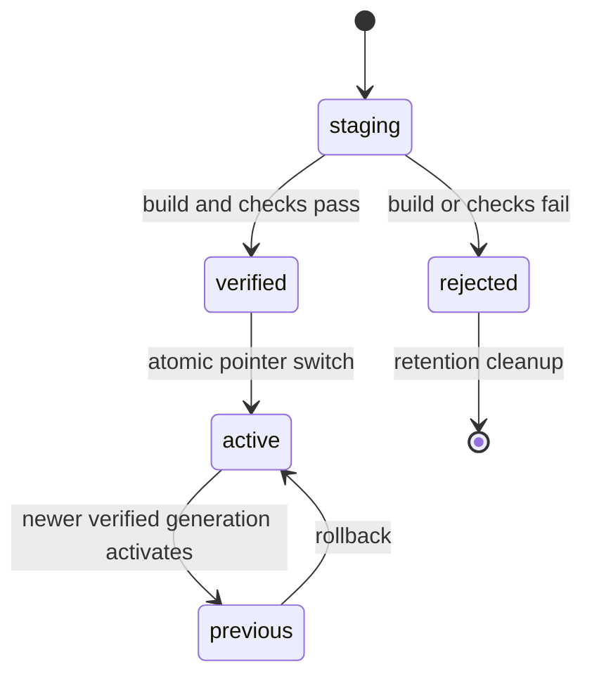

# Agent Note: Live-source desktop evolution and extension distribution

Status: proposed

English | [中文](2026-08-14-live-source-desktop-evolution.zh.md)

## Problem

The Electron surface can run the shared Harness Host and Client graph, but its installed application is still an immutable build artifact. A user who asks the agent to change the product must currently edit a separate checkout, rebuild it, and restart the application manually. The profile plugin command is also terminal-only, runtime inventory is read-only, and the repository does not define how an installed desktop application receives official core changes without overwriting user customization or how that customization is published to a user-owned repository.

Treating the installation directory as the writable source tree would make updates fragile. An installer, code-signing replacement, antivirus quarantine, or partial build could destroy the only copy of user work. Treating every change as an opaque binary application update would discard the Harness plugin architecture and prevent the agent from evolving the product through the same source and profile mechanisms maintainers use.

## Proposal

The desktop product consists of an immutable application kernel and a mutable source workspace under the Harness home. The kernel supplies Electron, the currently verified runtime, recovery UI, Git and package-operation adapters, and a source capsule. The mutable workspace is an ordinary Git repository that contains the complete Harness source and remains inspectable and editable by the user and the agent.

The product exposes three independent evolution lanes:

| Lane | Unit | Activation | Failure scope |
| --- | --- | --- | --- |
| Dynamic package | Cordis Host and Client JavaScript package | Existing `cordis_define` / `cordis_run` lifecycle | One dynamic package Fiber |
| Profile extension | Installed npm, Git, or filesystem dependency exporting `dsh.bundle` | Live profile recomposition; restart only when a package changes the immutable Electron kernel | One profile generation |
| Core source | Files in the managed Git workspace | Incremental build into a staged generation, verification, then atomic activation | One staged generation; the last verified generation remains runnable |

No lane writes application resources in place. Source, dependencies, build output, activation metadata, and logs live below `$DSH_HOME`; a signed application update may replace the kernel without replacing those directories.

### Filesystem model

```text
$DSH_HOME/
  source/deepseek-harness/          mutable Git working copy
  profiles/<name>/                 mutable profile manifest and patch layer
  generations/<generation-id>/     immutable verified runtime generations
  state/evolution.json             active, previous, and staged generation ids
  logs/evolution/                   bounded operation diagnostics
```

The packaged application carries a source capsule made from the exact source snapshot used for packaging. On first explicit initialization, the source provider clones that capsule into `$DSH_HOME/source/deepseek-harness`. A source launch uses its current repository directly. If a distribution deliberately omits a capsule, initialization may clone the official repository, but the product must report that network dependency before starting it.

The source capsule is a Git bundle, not an extracted directory. It preserves a common commit history with the official repository, gives the materialized workspace a clean status, and lets subsequent fetch, merge, commit, and push operations use ordinary Git semantics. Packaging from a dirty development checkout creates a dedicated capsule commit in a temporary clone; it never modifies the maintainer's repository.

### Repository ownership and remotes

The managed repository uses two roles with different authority:

| Role | Default remote | Default URL | Allowed writes |
| --- | --- | --- | --- |
| Official core | `upstream` | `https://github.com/deepseek-ai/deepseek-harness.git` | Fetch only |
| User customization | `origin` | Explicit user configuration | Normal push only |

The official URL is a product default and remains configurable for mirrors. The user remote has no default. A remote whose normalized repository identity equals the official repository is never treated as a writable user remote. HTTP remote URLs containing embedded credentials are rejected; authentication remains in Git Credential Manager, SSH agent, or another Git-owned credential store.

Official update is a serialized transaction:

1. Require a valid Git working tree and a non-detached current branch.
2. Refuse a dirty working tree, an unfinished merge, rebase, cherry-pick, or revert.
3. Ensure the official remote has the configured fetch URL, then fetch the configured official branch with pruning.
4. Integrate `refs/remotes/upstream/<branch>` by either `ff-only` or `merge`. The default is `merge`: it fast-forwards when possible and creates a normal merge commit when user commits diverged. Rebase is not offered because it would make a later push require history rewriting.
5. If merge reports conflicts, abort the merge before returning the failure so the pre-operation working tree remains the active source state.
6. Resolve dependencies, build into a new staging generation, run the generation verification set, and publish activation metadata atomically.

Fetching and inspecting are separate read-oriented operations so the UI can report available commits without integrating them. The first implementation may stop after step 5 while the generation builder is being delivered, but it must label this state as “source updated; runtime unchanged” and must not imply that the running desktop has changed.

Publishing customization is also serialized. It requires a configured user remote, a named current branch, and a clean working tree so uncommitted work is not silently omitted. It executes a normal `git push --set-upstream origin HEAD:refs/heads/<branch>` and never adds `--force`. A later explicit history-rewrite workflow may use `--force-with-lease` only after proving the expected remote object id.

### Generation lifecycle

A generation is an immutable directory containing the built Host packages, Client bundles, frontend shell, resolved production dependency tree, build manifest, source commit, dirty-state assertion, and verification receipt. Its state machine is:



The running Host is supervised outside the mutable generation. Client-only packages may hot-swap through the existing client module revision path. Host changes start a candidate Host against the staged generation, wait for readiness, then move new sessions to it; existing sessions either drain on the previous Host or are explicitly restarted according to their persistence guarantees. Electron main-process, preload, native-addon, and Chromium-version changes belong to the kernel lane and require a signed application update or restart.

Activation records include the source commit, dependency lock hash, build manifest hash, verification commands, verification outcome, activation time, and previous generation. Startup falls back to the previous verified generation after a bounded candidate failure. Safe mode starts the kernel with source mutation, third-party profile bundles, and dynamic packages disabled while retaining repository inspection and rollback.

### Plugin center

The plugin center is a projection and control surface over three existing authorities rather than a second plugin system:

1. Cordis Loader inventory supplies configured entries, effective enablement, and Fiber phase.
2. The active profile manifest supplies system bundle layers and user-managed dependency specs.
3. Dynamic Cordis package storage supplies agent-authored package versions and current run state.

The first product slice manages profile dependencies and displays Loader inventory. It accepts one explicit npm, Git, tarball, or absolute filesystem package spec; installs with the bundled pnpm runtime; verifies the installed package manifest; and reconciles packages exporting `dsh.bundle` into `dsh.profile.bundles`. Update and remove operate only on user-managed dependencies. Installation-owned layers such as `dsh-base`, `dsh-web-app`, and `dsh-desktop-app` are visible but immutable from this surface.

Plugin install scripts remain deny-by-default under the profile's `pnpm-workspace.yaml`. A package requiring a build script is not silently trusted: the operation fails with pnpm's diagnostic until the exact package is allowlisted. Every mutation is serialized, bounded by configured time and output limits, and executed without a shell through the subprocess capability.

Profile composition watches the profile manifest and lockfile as well as user patch files. After a successful package operation, a fresh composition resolves the current bundle list and applies it through the root Include entry. A package whose profile patch is Host- and Client-HMR-safe becomes live without restarting; packages that change the Electron kernel or native closure report a restart requirement.

A later catalog provider API may add signed registries, organization catalogs, compatibility metadata, reviews, pricing, and policy. Catalog metadata never grants execution authority: install, profile activation, Loader mount, and dynamic package execution remain separate audited transitions.

### Host and Client packages

The capability topology is:

```text
source-repository             Service Definition
└─ source-repository-git      local Git provider over ctx.subprocess

profile-plugins               Service Definition
└─ profile-plugins-pnpm       local bundled-pnpm provider over ctx.subprocess

evolution-control            trusted Host Remote consumer of both services
└─ api-remotes               selected Client Remote assembly
   └─ plugin-center UI       repository and extension controls
```

Service Definitions own domain request and result types. Providers own executable lookup, command construction, timeout and output policy, repository/profile filesystem effects, and operation serialization. The Host gateway contains no Git or pnpm mechanics. The Client contains no path or command construction and calls only generated Remote methods.

All mutating Remote methods and all methods exposing repository paths, remote URLs, or dependency specs are privileged configuration-plane methods. The browser carrier admits them only from loopback same-origin; the Electron carrier admits them only through the internal `dsh://app` origin. This is a transport admission rule, not user authentication; remote multi-user deployment requires a separate authenticated authority layer before exposing the control plane.

### Commercial extension points

The architecture reserves product differentiation at explicit seams:

- Signed plugin catalogs with publisher identity, malware review, compatibility ranges, revocation, and organization policy.
- Team repositories and protected-branch workflows for generated customization.
- Remote build and signing workers that produce verified generations for machines without a local toolchain.
- Generation provenance, audit export, staged rollout rings, and policy-enforced verification suites.
- Paid private catalogs and organization-scoped source templates without changing the profile or Loader formats.

These services add policy and distribution around the open plugin and source mechanisms. They do not fork the Cordis runtime or introduce a proprietary plugin format.

## Alternatives considered

**Mutating the installed Electron resources directly.** Rejected because application replacement, signing, ASAR, native modules, and partial writes make the install directory an unsafe source of truth. It also removes the last-known-good runtime needed for recovery.

**Using only binary application auto-update.** Rejected because it cannot preserve arbitrary source customization or let the agent create and activate ordinary Harness plugins. Binary update remains the kernel lane for Electron and native changes.

**Rebasing user commits onto every official update.** Rejected because routine updates would rewrite published user history and require force pushes. Normal merge preserves both histories and supports an empty user repository with ordinary push semantics.

**Forking the official repository into the user's repository and treating it as the only remote.** Rejected because update and publication authority become ambiguous. Separate `upstream` and `origin` roles make fetch-only official state and writable user state independently auditable.

**Building a new marketplace plugin format.** Rejected because `dsh.bundle`, Loader entries, Client bundles, and dynamic Cordis packages already define the product's extension units. The center should add discovery, policy, and lifecycle management around those units.

**Running system pnpm through a shell.** Rejected because a packaged desktop cannot assume pnpm is installed, shell quoting would turn package text into command syntax, and ambient credentials could leak. The provider invokes an exact bundled pnpm entry with argv through `ctx.subprocess`.

## Acceptance criteria

- A packaged desktop contains a source capsule generated from its exact packaging snapshot and can materialize a clean Git workspace without a manual clone.
- The source control surface distinguishes official and user remotes, fetches and merges the configured official branch, aborts conflicted merges, rejects dirty or in-progress repositories, configures a non-official user remote, and performs normal non-force pushes.
- The plugin center displays immutable system layers, user-managed profile dependencies, and live Loader entries; it installs, updates, and removes user-managed packages through bundled pnpm and reconciles `dsh.bundle` layers.
- Browser transport pins the complete evolution control plane to loopback; Electron uses only its internal same-origin carrier.
- Every subprocess has explicit cwd, argv, environment, time, output, and termination limits; concurrent mutations are serialized and teardown reaches process quiescence.
- Profile dependency changes trigger fresh profile composition, with activation or restart requirement reported from actual package/runtime facts.
- A failed source update, package operation, build, or activation leaves the previous verified runtime selectable and does not delete the user's source workspace.
- The generation builder records reproducible provenance and supports atomic activation, rollback, and safe mode before the product claims that arbitrary TypeScript source changes update the running desktop.

## Risks

Git merge preserves history but can still require human conflict resolution; automatic conflict abortion protects the current state but cannot decide project semantics. Bundling repository history increases installer size, while a shallow capsule complicates later publication and history repair. Bundled pnpm expands the trusted dependency closure and must remain version-pinned with its install-script policy intact. Live profile recomposition can expose lifecycle defects in third-party plugins, so safe mode and last-known-good generation selection are required before enabling an unrestricted public catalog. The first implementation can manage source and plugins before the generation builder exists, but product copy and model context must state that source changes do not alter the active runtime until a verified generation activates.
