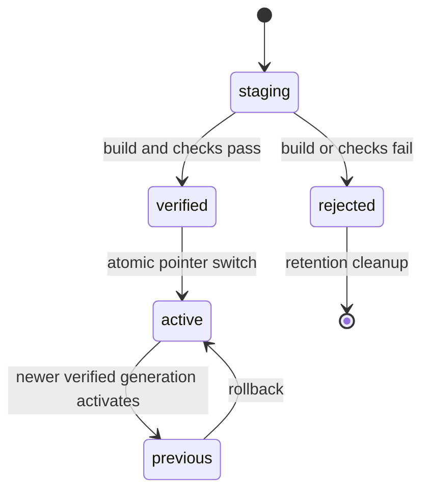

# Agent Note: 可演进源码桌面架构与扩展分发

Status: proposed

[English](2026-08-14-live-source-desktop-evolution.md) | 中文

## Problem

Electron 端已经能够运行 Harness 共用的 Host 与 Client 插件图，但安装后的应用仍然是不可变构建产物。用户要求 Agent 修改产品时，目前仍需编辑另一份检出、手动构建并重启应用。Profile 插件管理也只存在于终端，运行时插件清单只读；仓库尚未定义桌面安装后如何接收官方核心更新且不覆盖用户定制，以及如何把这些定制发布到用户自己的仓库。

若把安装目录直接当作可写源码树，安装器替换、代码签名更新、杀毒软件隔离或构建中断都可能毁掉用户工作的唯一副本。若把所有变化都处理成不透明的二进制应用更新，则会绕开 Harness 的插件架构，也无法让 Agent 通过维护者正在使用的源码和 Profile 机制持续演进产品。

## Proposal

桌面产品由不可变应用内核与 Harness home 下的可变源码工作区组成。内核提供 Electron、当前已验证运行时、恢复界面、Git 与包操作适配器以及源码胶囊。可变工作区是普通 Git 仓库，包含完整 Harness 源码，用户和 Agent 都能检查与编辑。

产品提供三条相互独立的演进通道：

| 通道 | 变更单元 | 激活方式 | 失败范围 |
| --- | --- | --- | --- |
| 动态包 | Cordis Host 与 Client JavaScript 包 | 现有 `cordis_define` / `cordis_run` 生命周期 | 单个动态包 Fiber |
| Profile 扩展 | 导出 `dsh.bundle` 的 npm、Git 或文件系统依赖 | Profile 实时重组；仅修改不可变 Electron 内核时重启 | 单个 Profile generation |
| 核心源码 | 托管 Git 工作区中的文件 | 增量构建到暂存 generation，验证后原子激活 | 单个暂存 generation；上一已验证 generation 保持可运行 |

任何通道都不得原地写入应用资源。源码、依赖、构建输出、激活元数据和日志都位于 `$DSH_HOME` 下；签名应用更新可以替换内核，但不得替换这些目录。

### 文件系统模型

```text
$DSH_HOME/
  source/deepseek-harness/          mutable Git working copy
  profiles/<name>/                 mutable profile manifest and patch layer
  generations/<generation-id>/     immutable verified runtime generations
  state/evolution.json             active, previous, and staged generation ids
  logs/evolution/                   bounded operation diagnostics
```

打包应用携带由本次打包所用精确源码快照生成的源码胶囊。用户首次明确初始化时，源码 provider 将胶囊 clone 到 `$DSH_HOME/source/deepseek-harness`。从源码启动时直接使用当前仓库。若某种发行物明确不带胶囊，初始化可以 clone 官方仓库，但产品必须在开始前明确报告该网络依赖。

源码胶囊采用 Git bundle，而不是解压目录。它保留与官方仓库共同的提交历史，使物化后的工作区保持 clean，并让之后的 fetch、merge、commit 与 push 继续使用普通 Git 语义。从脏开发工作区打包时，打包器在临时 clone 中创建专用胶囊提交，绝不修改维护者仓库。

### 仓库归属与 remote

托管仓库使用两个权限不同的角色：

| 角色 | 默认 remote | 默认 URL | 允许写入 |
| --- | --- | --- | --- |
| 官方核心 | `upstream` | `https://github.com/deepseek-ai/deepseek-harness.git` | 仅 fetch |
| 用户定制 | `origin` | 由用户明确配置 | 仅普通 push |

官方 URL 是产品默认值，也可为镜像配置。用户 remote 没有默认值。标准化仓库身份与官方仓库相同的 remote 永远不能被视为可写用户 remote。包含内嵌凭据的 HTTP remote URL 会被拒绝；认证继续由 Git Credential Manager、SSH agent 或其他 Git 自有凭据存储承担。

官方更新是串行事务：

1. 要求存在有效 Git 工作树且当前分支不是 detached HEAD。
2. 工作树为 dirty，或存在未完成的 merge、rebase、cherry-pick、revert 时拒绝更新。
3. 确保官方 remote 使用配置的 fetch URL，然后带 prune fetch 指定官方分支。
4. 通过 `ff-only` 或 `merge` 集成 `refs/remotes/upstream/<branch>`。默认使用 `merge`：可以快进时直接快进，用户提交已经分叉时创建普通 merge commit。系统不提供 rebase，因为后续 push 将因此需要改写历史。
5. merge 报告冲突时，在返回失败前执行 merge abort，使操作前工作树继续作为当前源码状态。
6. 解析依赖，构建新的暂存 generation，运行 generation 验证集，再原子发布激活元数据。

fetch 与 inspect 是独立的读取型操作，UI 可以在不集成提交的情况下报告可用更新。generation builder 交付前，第一阶段实现可以停在第 5 步，但必须显示“源码已更新，运行时未变化”，不得暗示当前桌面已经发生变化。

发布用户定制同样串行执行。它要求已配置用户 remote、当前分支有名称且工作树 clean，避免未提交工作被静默遗漏。命令固定为普通 `git push --set-upstream origin HEAD:refs/heads/<branch>`，绝不附加 `--force`。未来若增加显式历史改写流程，只能在证明期望 remote object id 后使用 `--force-with-lease`。

### Generation 生命周期

Generation 是不可变目录，包含已构建 Host 包、Client bundle、前端 shell、解析后的生产依赖树、构建 manifest、源码提交、clean 状态断言和验证回执。其状态机为：



运行中的 Host 由可变 generation 之外的组件监督。仅 Client 的包可以通过现有 Client module revision 路径热替换。Host 变化会从暂存 generation 启动 candidate Host，等待 readiness 后把新 Session 转交给它；已有 Session 按其持久化保证在旧 Host 排空，或被明确重启。Electron 主进程、preload、原生 addon 与 Chromium 版本变化属于内核通道，需要签名应用更新或重启。

激活记录包含源码提交、依赖锁文件 hash、构建 manifest hash、验证命令、验证结果、激活时间和上一 generation。Candidate 在有界时间内失败时，启动流程回退到上一已验证 generation。Safe mode 使用内核启动，禁用源码写入、第三方 Profile bundle 与动态包，但保留仓库检查与回滚。

### 插件中心

插件中心是三个现有权威状态的投影与控制面，而不是第二套插件系统：

1. Cordis Loader inventory 提供配置 entry、有效启用状态和 Fiber phase。
2. 当前 Profile manifest 提供系统 bundle layer 与用户管理的依赖 spec。
3. 动态 Cordis 包存储提供 Agent 编写的包版本与当前 run 状态。

第一阶段产品面管理 Profile 依赖并显示 Loader inventory。它接受一个明确的 npm、Git、tarball 或绝对文件系统包 spec；使用随应用打包的 pnpm runtime 安装；校验已安装 package manifest；并把导出 `dsh.bundle` 的包同步到 `dsh.profile.bundles`。Update 与 remove 只能操作用户管理的依赖。`dsh-base`、`dsh-web-app`、`dsh-desktop-app` 等安装自带 layer 可见，但不能从该界面修改。

Profile 的 `pnpm-workspace.yaml` 继续默认拒绝插件安装脚本。需要构建脚本的包不会被静默信任：在精确包名加入 allowlist 前，操作保留 pnpm 的失败诊断。所有 mutation 都串行执行，受可配置时间和输出上限约束，并通过 subprocess capability 以无 shell 方式执行。

Profile composition 除用户 patch 文件外，还监视 Profile manifest 与 lockfile。包操作成功后，系统重新解析当前 bundle 列表，并通过 root Include entry 应用全新 composition。Profile patch 具备 Host 与 Client HMR 安全性的包可以无需重启生效；修改 Electron 内核或原生闭包的包会报告需要重启。

后续 catalog provider API 可以增加签名 registry、组织 catalog、兼容性元数据、评价、定价与策略。Catalog 元数据不授予执行权限：install、Profile activation、Loader mount 与动态包执行仍是相互独立且可审计的状态变化。

### Host 与 Client 包

Capability 拓扑如下：

```text
source-repository             Service Definition
└─ source-repository-git      local Git provider over ctx.subprocess

profile-plugins               Service Definition
└─ profile-plugins-pnpm       local bundled-pnpm provider over ctx.subprocess

evolution-control            trusted Host Remote consumer of both services
└─ api-remotes               selected Client Remote assembly
   └─ plugin-center UI       repository and extension controls
```

Service Definition 拥有领域 request 与 result 类型。Provider 拥有可执行文件解析、命令构造、超时与输出策略、仓库和 Profile 文件系统副作用以及操作串行化。Host gateway 不包含 Git 或 pnpm 机制。Client 不构造路径或命令，只调用生成的 Remote 方法。

所有 mutation Remote，以及暴露仓库路径、remote URL 或依赖 spec 的方法，都属于特权配置面。浏览器 carrier 只允许 loopback same-origin 调用；Electron carrier 只允许内部 `dsh://app` origin 调用。这是 transport admission 规则，不是用户认证；远程多用户部署必须先增加独立认证与授权层，才能暴露该控制面。

### 商业扩展点

架构在明确 seam 上保留产品差异化能力：

- 带 publisher identity、恶意代码审核、兼容范围、撤销与组织策略的签名插件 catalog。
- 面向生成式定制的团队仓库与 protected branch 工作流。
- 为缺少本地工具链的机器生成已验证 generation 的远程构建与签名 worker。
- Generation provenance、审计导出、分批发布 ring 与策略强制验证集。
- 不改变 Profile 或 Loader 格式的付费私有 catalog 与组织级源码模板。

这些服务在开放插件与源码机制周围增加策略和分发能力，不 fork Cordis runtime，也不引入专有插件格式。

## Alternatives considered

**直接修改已安装 Electron 资源。** 拒绝，因为应用替换、签名、ASAR、原生模块和部分写入会让安装目录成为不安全的源码真相源，也会丢失恢复所需的上一可用运行时。

**只使用二进制应用自动更新。** 拒绝，因为它无法保留任意源码定制，也无法让 Agent 创建和激活普通 Harness 插件。二进制更新仅保留为 Electron 与原生变更的内核通道。

**每次官方更新都把用户提交 rebase 到新版本。** 拒绝，因为日常更新会改写已经发布的用户历史并要求 force push。普通 merge 保留双方历史，也支持向空用户仓库执行普通 push。

**把官方仓库 fork 到用户仓库，并将其作为唯一 remote。** 拒绝，因为更新权限与发布权限会变得含混。独立的 `upstream` 与 `origin` 角色使只读官方状态和可写用户状态可以分别审计。

**建立新的市场插件格式。** 拒绝，因为 `dsh.bundle`、Loader entry、Client bundle 与动态 Cordis 包已经定义了产品扩展单元。插件中心应围绕这些单元增加发现、策略与生命周期管理。

**通过 shell 运行系统 pnpm。** 拒绝，因为打包桌面不能假设机器已安装 pnpm，shell quoting 会把包文本变成命令语法，ambient credential 也可能泄漏。Provider 通过 `ctx.subprocess` 以 argv 调用精确的内置 pnpm entry。

## Acceptance criteria

- 打包桌面包含由精确打包快照生成的源码胶囊，无需用户手动 clone 即可物化 clean Git 工作区。
- 源码控制面区分官方和用户 remote；能够 fetch 与 merge 配置的官方分支；冲突时 abort merge；拒绝 dirty 或存在进行中操作的仓库；能够配置非官方用户 remote 并执行不带 force 的普通 push。
- 插件中心显示不可变系统 layer、用户管理的 Profile 依赖与实时 Loader entry；通过内置 pnpm 安装、更新和移除用户包，并同步 `dsh.bundle` layer。
- 浏览器 transport 将完整演进控制面限制在 loopback；Electron 只使用内部 same-origin carrier。
- 每个 subprocess 都有明确 cwd、argv、environment、时间、输出与终止限制；并发 mutation 串行执行，teardown 等待进程完全退出。
- Profile 依赖变化触发全新 Profile composition，并根据实际包和运行时事实报告已激活或需要重启。
- 源码更新、包操作、构建或激活失败时，上一已验证运行时仍可选择，且不得删除用户源码工作区。
- 在产品宣称任意 TypeScript 源码能更新当前桌面前，generation builder 已记录可复现 provenance，并支持原子激活、回滚和 safe mode。

## Risks

Git merge 会保留历史，但仍可能需要人工解决冲突；自动 abort 可以保护当前状态，却不能代替项目语义判断。打包仓库历史会增加安装包体积，而 shallow 胶囊会增加后续发布与历史修复复杂度。内置 pnpm 扩大受信任依赖闭包，必须保持版本固定与安装脚本策略。Profile 实时重组可能暴露第三方插件生命周期缺陷，因此在开放不受限公共 catalog 前必须具备 safe mode 与上一可用 generation 选择。第一阶段可以先管理源码与插件，再交付 generation builder，但产品文案和模型上下文必须明确：已更新源码只有在已验证 generation 激活后才改变当前运行时。
