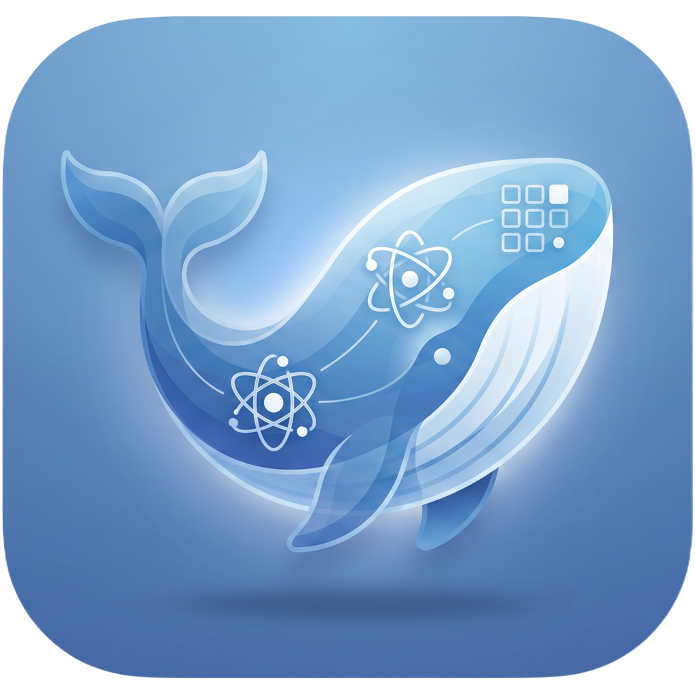

<h1 align="center">
  
  DSH Desktop
</h1>

<p align="center">
  A local-first, cross-platform desktop shell for
  <a href="https://github.com/deepseek-ai/deepseek-harness">DeepSeek Harness</a>.
</p>

<p align="center">
  <a href="README.md">简体中文</a> · <a href="README.en.md">English</a>
</p>

<p align="center">
  <a href="LICENSE"></a>
  
  
  
</p>


<p align="center"><strong>Beyond official DeepSeek models, DSH Desktop supports mainstream third-party model providers—with more DSH-powered desktop experiences coming soon.</strong></p>

DSH Desktop packages the local DeepSeek Harness web experience as a desktop application. It launches a local Harness instance automatically, manages a random loopback port, persists profiles, plugins, and sessions, and opens the full interface as soon as Harness is ready. Project workspaces are added and managed entirely in the Harness interface.

> [!IMPORTANT]
> DSH Desktop is not a simple repackaging of upstream DeepSeek Harness. It turns frequently used capabilities into maintained, built-in desktop features, including phone access over LAN or a temporary public tunnel, an integrated plugin marketplace, runtime preparation, automatic updates, and failure recovery. The goal is a genuinely ready-to-use Harness desktop app: install it and get to work without assembling plugins, configuring services, or managing the runtime yourself.
>
> The project is currently an early preview and tracks the rapidly evolving `@deepseek-ai/dsh@0.1.1-rc.1`. Installers and update metadata are published through this repository's GitHub Releases.

## Download

Download DSH Desktop for macOS, Windows, or Linux x64 from [GitHub Releases](https://github.com/citizenll/desktop-harness/releases/latest). Linux is available as a portable AppImage and a `.deb` package for Debian/Ubuntu.

Installed macOS and Windows builds check this repository's GitHub Releases for updates automatically after startup and every six hours. Updates download in the background and prompt you to restart when they are ready. You can also choose **Check for Updates…** from the application menu.

## Why this project exists

DeepSeek Harness already provides a complete agent runtime and Web UI. DSH Desktop does not reimplement Harness; it supplies the host capabilities needed for a desktop product:

- Run without manually starting a CLI or managing local ports
- Create an application-owned Harness launch directory automatically at startup
- Add and manage project workspaces through Harness's built-in directory picker
- Manage the Harness child process, readiness checks, logs, and shutdown in one place
- Store profiles, plugins, and sessions outside the application installation directory so upgrades do not remove user data
- Provide packaging entry points for macOS, Windows, and Linux

## Features

- Opens directly into Harness without an additional landing page
- Starts without an initial directory prompt by creating and reusing an internal launch directory
- Offers retry, log viewing, and exit actions when Harness fails to start
- Provides Harness menu actions for restarting the child process and viewing its log
- Gracefully terminates the Harness child process when the desktop app exits
- Listens only on a random `127.0.0.1` port for each launch
- Removes Node.js privileges from the renderer and enables `contextIsolation`, sandboxing, and navigation restrictions
- Uses the DSH brand logo consistently in the desktop window and Harness sidebar
- Lets phones connect through the best physical Wi-Fi/Ethernet address or an on-demand temporary Cloudflare public route; both routes still require desktop approval
- Imports and exports complete custom Agent presets as portable [`.dshpreset` packages](docs/preset-packages.md), with conflict checks and a trust warning before installation
- Includes a production DSH app icon in macOS ICNS, Windows ICO, and Linux PNG formats

## Quick start

### Requirements

- Node.js 22 or later
- npm
- macOS on Apple Silicon or Intel, Windows x64, or Linux x64

### Local development

```bash
git clone https://github.com/citizenll/desktop-harness.git
cd desktop-harness
npm install
npm run dev
```

`npm install` runs `patch-package` to reapply DSH Desktop's model-provider onboarding, preset package transfer, and sidebar branding, installs the brand asset, and then installs the Electron runtime.

### Quality checks

```bash
npm test
npm run typecheck
npm run build
```

`npm run build` only produces minified bundles for the main process and preload. Use `npm run package:dir` to inspect the final distribution layout; it creates the `.runtime/` staging directory, packages it, and verifies the result.

### Packaging

```bash
# Generate unsigned DMG and ZIP artifacts for the current Mac architecture
npm run package:mac

# Run each command on a Mac or CI runner with the matching architecture
npm run package:mac:arm64
npm run package:mac:x64

# Generate an NSIS installer on a Windows x64 machine or runner
npm run package:win

# Generate AppImage and DEB packages on a Linux x64 machine or runner
npm run package:linux
```

Harness includes architecture-specific native modules. Dependencies must be reinstalled and built on the matching platform for macOS ARM64, macOS Intel, Windows x64, and Linux x64. The architecture-specific scripts validate the current `platform/arch` before packaging to prevent artifacts that appear successful but are missing native dependencies.

Release builds never let Electron Builder infer files from the repository root. `scripts/prepare-runtime.mjs` starts from a clean production dependency install, reapplies pinned patches and brand assets, and collects only bundles, runtime resources, and native files for the current platform into `.runtime/`. Pure JavaScript and static assets go into `app.asar`; only files that must exist on disk, such as `.node`, DLL, EXE, and WASM files, are unpacked. The Electron runtime also serves as the Node worker for Harness and pnpm, so the installer no longer carries a second Node.js runtime.

## Runtime architecture

```text
DSH Desktop (Electron Main)
├── Application-owned launch directory
├── Harness child-process lifecycle
├── Random loopback port and readiness checks
├── Native logging and recovery actions
└── Hardened BrowserWindow
     └── http://127.0.0.1:<random>  DeepSeek Harness Web UI

Electron userData
├── launch-root/
├── logs/harness.log
└── harness/
    ├── profiles/
    ├── sessions/
    └── Plugins and user data
```

Harness runs in a separate Electron Node child process. The `--expose-internals` permission required by Cordis HMR is granted only to that child process and never to the web renderer. Profile plugins remain in their user-owned directories; when they import bundled DSH dependencies, a desktop module-resolution fallback loads them from the read-only `app.asar` runtime without copying the full dependency tree into the profile.

## Project structure

```text
src/main/             Electron main process, windows, and Harness lifecycle
src/shared/           Shared runtime types
patches/              Reproducible UI customizations for the pinned DSH version
scripts/              Runtime staging, artifact verification, branding, and platform checks
test/                 Settings, runtime, security, and provider coverage tests
build/                Application icons, installer resources, and runtime module hook
.runtime/             Generated minimal release directory (not committed)
```

## Current validation status

- macOS Apple Silicon: development workflow, real Harness startup, DMG packaging, code signing, Apple notarization, and mounted artifact verified
- macOS Intel: packaging configuration and platform checks provided; runtime verification still requires an Intel Mac or runner
- Windows x64: Electron Node worker, real Harness startup, profile-plugin dependency resolution, native modules, and NSIS artifact verified
- Linux x64: AppImage and DEB release artifacts are built and verified natively on an Ubuntu runner
- Windows ARM64: not currently supported
- Automatic updates: macOS and Windows check and download from this repository's GitHub Releases; Linux currently updates manually from Releases

## Upstream version and patches

The project currently pins `@deepseek-ai/dsh@0.1.1-rc.1`. The initial provider list and desktop preset-transfer surface are captured with [`patch-package`](https://github.com/ds300/patch-package) under [`patches/`](patches/) rather than relying on untracked changes in `node_modules`.

When upgrading DSH:

1. Verify the upstream Settings, Credentials, and Provider Directory contracts.
2. Reapply or rewrite the customized onboarding interface.
3. Regenerate the patch.
4. Run regression checks against a real Harness startup and provider configuration flow.

## Contributing

Issues and pull requests are welcome. Before submitting a change, run at least:

```bash
npm test
npm run typecheck
npm run build
```

Never include real API keys in issues, logs, screenshots, or test data.

## License

This project is open source under the [MIT License](LICENSE).

DeepSeek Harness and its dependencies remain subject to their respective upstream licenses and trademark policies. DSH Desktop is an independent community desktop wrapper.
