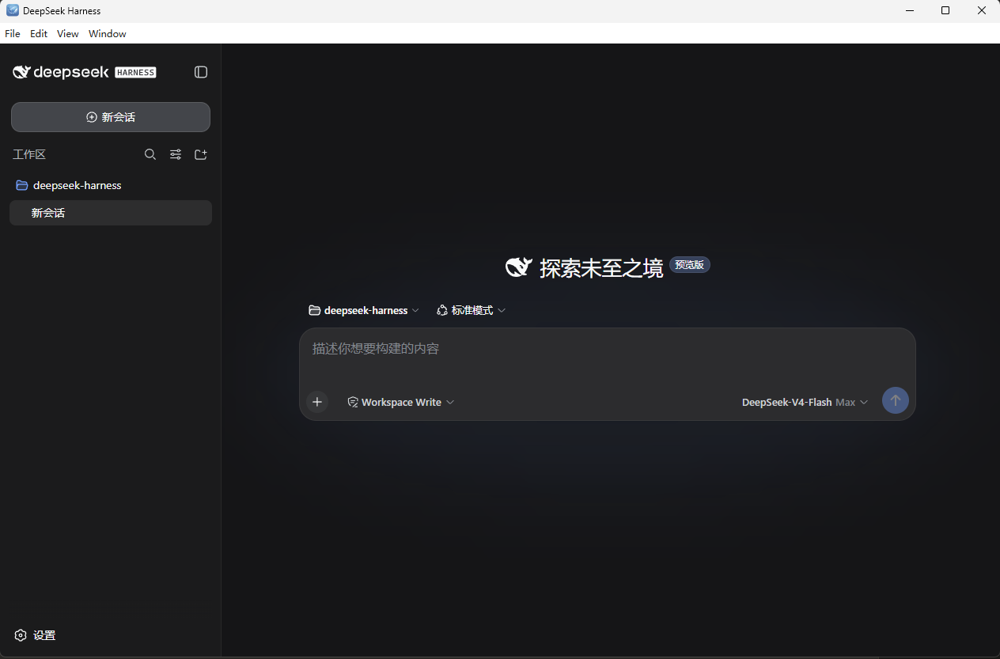

# Desktop Harness

[中文](README.md) | English

<p align="center">
  
</p>

Desktop Harness is an Electron desktop distribution of [DeepSeek Harness](https://github.com/deepseek-ai/deepseek-harness). It keeps the official Cordis architecture—**everything is a plugin**—and adds a native application shell, a managed source workspace, official-upstream synchronization, user-owned repository publishing, and a plugin center.

**Developer preview:** interfaces, source formats, and desktop distribution details may change before the first tagged release.

## Ship of Theseus evolution model

The desktop is designed as an immutable Electron kernel supervising mutable source, profile extensions, and verified runtime generations. Users install the application once; the packaged source capsule can then materialize a normal Git repository under the Harness home, where the user or agent can inspect and customize the complete product without making another manual clone.

Official code and user customization have separate authority. The application fetches and integrates the official [`deepseek-ai/deepseek-harness`](https://github.com/deepseek-ai/deepseek-harness) history through a fetch-only `upstream` remote, while an explicitly configured `origin` belongs to the user and receives ordinary, non-force pushes. Profile extensions continue to use the existing Harness bundle and Cordis Loader mechanisms instead of introducing a second plugin format.

The current release deliberately does not claim that arbitrary TypeScript edits instantly replace the running application. Source initialization, fetch, merge, and push update the managed working copy; verified generation build, atomic activation, rollback, and safe mode remain the next runtime milestone. The complete design is recorded in the [live-source desktop evolution proposal](.agents/notes/proposed/architecture/2026-08-14-live-source-desktop-evolution.md).

| Layer | Responsibility | Current state |
| --- | --- | --- |
| Electron kernel | Window lifecycle, recovery surface, native integration, and the zero-port `dsh://app` carrier | Available; kernel changes require a rebuilt or signed application update |
| Profile extensions | npm, Git, tarball, or local packages exporting `dsh.bundle` | Install, update, remove, Host recomposition, and renderer reload are available |
| Managed source | Complete Git workspace created from the exact packaged source snapshot | Initialize, inspect, fetch, merge, configure a user remote, and push are available |
| Runtime generations | Immutable builds with provenance, verification, atomic activation, rollback, and safe mode | Designed; implementation remains pending before live source activation is advertised |

## Desktop highlights

- **One product graph:** the desktop reuses the Web shell and the same Host and Client plugin roster; conversation, trajectory, settings, credentials, presets, terminals, tools, and extension surfaces stay shared.
- **No listening port:** Electron serves assets, boot metadata, plugin bundles, RPC, and event streams through the privileged same-origin `dsh://app` protocol.
- **Source included:** every desktop package contains a Git source capsule produced from the exact packaging snapshot, including a validated capture of local tracked and untracked changes.
- **Two-repository workflow:** pull official evolution from `upstream`, preserve local commits through normal merges, and publish customization to a user-owned `origin` without force pushing.
- **Plugin center:** inspect system bundles and live Loader entries, then install, update, or remove user-managed profile extensions with the bundled pnpm runtime.
- **Native workspace selection:** the desktop uses an operating-system directory picker rather than a browser-only filesystem prompt.
- **Hardened renderer:** Chromium sandboxing, context isolation, blocked remote scripts, denied permission requests, and external-link handoff are enabled by default.

## Run

### Run from source

Install Node.js `^22.19.0` or `>=24.0.0` and pnpm, then run:

```sh
git clone https://github.com/citizenll/desktop-harness.git
cd desktop-harness
pnpm install
pnpm run desktop
```

`pnpm run desktop` builds the required artifacts and starts Electron. To launch an existing build, run `pnpm run desktop:built`. To create a platform-local application bundle, run:

```sh
pnpm run package:desktop
```

Packaged output is written below `.artifacts/desktop/DeepSeekHarness-<platform>-<arch>`. See the [desktop application guide](apps/desktop/README.md) for smoke-test flags, packaging behavior, security details, and current limitations.

## Try source evolution and plugins

Open **Settings → Plugins** in the desktop application:

1. Use **Source & updates** to materialize the packaged source capsule, inspect repository state, fetch or merge the official branch, configure a user-owned remote, and push a clean branch.
2. Use **Plugin center** to inspect the active Cordis graph and manage profile extension packages.
3. Rebuild and restart the desktop after core source edits. Profile package changes already recompose the Host and reload the renderer when required; automatic verified source-generation activation is still pending.

## Architecture and development

The desktop profile layers [`dsh-base`](packages/bundle/base/README.md), [`dsh-web-app`](packages/bundle/web-app/README.md), and [`dsh-desktop-app`](packages/bundle/desktop-app/README.md). The Electron entry point in [`apps/desktop`](apps/desktop) owns the application lifecycle while the shared Harness packages remain the product API and plugin spine.

Start with the [architecture documentation](docs/architecture.md), [development guide](docs/development.md), and [contribution guide](CONTRIBUTING.md). Agents must also follow [AGENTS.md](AGENTS.md).

## Upstream and community

Desktop Harness builds on the open-source [DeepSeek Harness](https://github.com/deepseek-ai/deepseek-harness) project developed by [DeepSeek AI](https://deepseek.com) and on [Cordis](https://github.com/cordiverse/cordis). Add the [`dsh-plugin`](https://github.com/topics/dsh-plugin) topic to compatible plugin repositories, and join the [DeepSeek Harness Discord community](https://discord.gg/Ycq5dCaS4).

## License

[MIT](LICENSE). Third-party dependencies and their licenses are disclosed in [THIRD_PARTY_NOTICES.md](THIRD_PARTY_NOTICES.md).
